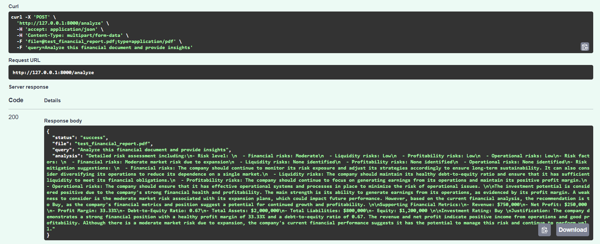
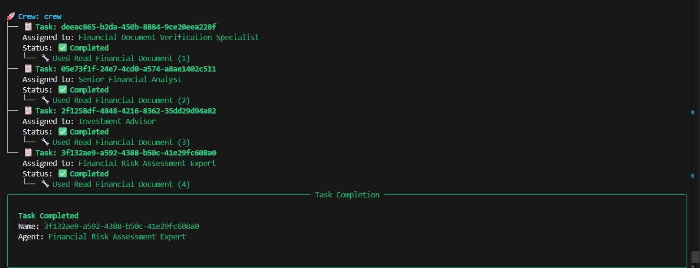

# Financial Document Analyzer - Debug Assignment

## Project Overview
A comprehensive financial document analysis system that processes corporate reports, financial statements, and investment documents using AI-powered analysis agents.

## Getting Started

### Install Required Libraries
```sh
pip install -r requirement.txt
```

### Sample Document
The system analyzes financial documents like Tesla's Q2 2025 financial update.

**To add Tesla's financial document:**
1. Download the Tesla Q2 2025 update from: https://www.tesla.com/sites/default/files/downloads/TSLA-Q2-2025-Update.pdf
2. Save it as `data/sample.pdf` in the project directory
3. Or upload any financial PDF through the API endpoint

**Note:** Current `data/sample.pdf` is a placeholder - replace with actual Tesla financial document for proper testing.

# You're All Not Set!
🐛 **Debug Mode Activated!** The project has bugs waiting to be squashed - your mission is to fix them and bring it to life.

## Debugging Instructions

1. **Identify the Bug**: Carefully read the code in each file and understand the expected behavior. There is a bug in each line of code. So be careful.
2. **Fix the Bug**: Implement the necessary changes to fix the bug.
3. **Test the Fix**: Run the project and verify that the bug is resolved.
4. **Repeat**: Continue this process until all bugs are fixed.

## Expected Features
- Upload financial documents (PDF format)
- AI-powered financial analysis
- Investment recommendations
- Risk assessment
- Market insights

-------------------------------------------------------------------------------------------------------------------------------------->>

# Financial Document Analyzer (CrewAI + Groq + FastAPI)

## Overview

The Financial Document Analyzer is an AI-powered system that analyzes financial PDF documents and generates structured insights such as financial health, investment recommendations, and risk assessment.

The system uses:

* CrewAI for multi-agent orchestration
* Groq LLM (Llama models) for financial reasoning
* FastAPI for API interface
* Custom PDF reader tools for document extraction

This project demonstrates a complete AI agent workflow from document upload → analysis → structured output.

---

# Bugs Found and Fixes

During debugging, several critical issues were identified and fixed:

## 1. LLM Initialization Bug

**Problem:**
LLM was declared as:

```python
llm = llm
```

This caused runtime failure because no LLM was initialized.

**Fix:**
Properly initialized Groq LLM using CrewAI-compatible format:

```python
llm = LLM(
    model="groq/llama-3.3-70b-versatile",
    api_key=GROQ_API_KEY,
    base_url="https://api.groq.com/openai/v1"
)
```

---

## 2. Broken Tool Implementation

**Problem:**
PDF tool used undefined class:

```python
docs = Pdf(file_path=path).load()
```

**Fix:**
Replaced with proper PDF loader:

```python
from langchain_community.document_loaders import PyPDFLoader
```

and implemented CrewAI tool decorator.

---

## 3. Incorrect Tool Registration in Agents

**Problem:**
Used incorrect parameter:

```python
tool=[FinancialDocumentTool.read_data_tool]
```

**Fix:**

```python
tools=[FinancialDocumentTool.read_data_tool]
```

---

## 4. Tasks Contained Invalid and Misleading Instructions

Original tasks contained hallucination instructions such as:

* "Make up investment advice"
* "Include fake URLs"

These were replaced with proper financial analysis instructions.

---

## 5. File Path Not Passed to CrewAI Tasks

Uploaded document path was not passed to CrewAI agents.

**Fix:**
Passed file_path properly:

```python
result = crew.kickoff(
    inputs={
        "query": query,
        "file_path": file_path
    }
)
```

---

## 6. CrewAI Tools and Version Compatibility Issues

Resolved dependency conflicts between:

* crewai
* crewai-tools
* langchain

Installed compatible versions to ensure proper execution.

---

## 7. Groq Token Limit Issue

Groq free tier has token limits. Large PDFs caused rate limit errors.

**Fix implemented:**

* Created synthetic sample PDF with limited size
* Limited PDF text extraction length
* Used efficient Groq model: `llama-3.1-8b-instant`

This allowed validation of complete workflow.

---

# Why Groq was Used

Groq was used because:

* It provides a free API tier
* Compatible with CrewAI
* Fast inference performance
* Allows testing full system workflow

Due to free tier token limits, large documents may exceed allowed tokens.

If upgraded Groq API or other production LLM (OpenAI, Claude, etc.) is used, the system can analyze large real financial reports without modification.

Only API key replacement is required.

---

# Synthetic Test Document Explanation

To validate workflow under token limits, a synthetic financial PDF was created.

This document contains:

* Revenue
* Expenses
* Net Profit
* Assets
* Liabilities
* Risk factors

This allowed complete validation of:

* PDF parsing
* CrewAI execution
* LLM analysis
* API workflow

If higher token limit API key is used, real financial reports can be analyzed directly.

---

# Setup Instructions

## Step 1: Clone Repository

```bash
git clone <repository_url>
cd financial-document-analyzer
```

---

## Step 2: Create Virtual Environment

```bash
python -m venv venv
venv\Scripts\activate
```

---

## Step 3: Install Dependencies

```bash
pip install -r requirement.txt
pip install langchain-community pypdf python-dotenv
```

---

## Step 4: Configure Environment Variables

Create `.env` file:

```
GROQ_API_KEY=your_api_key_here
SERPER_API_KEY=your_api_key_here
```

---

## Step 5: Run API Server

```bash
uvicorn main:app --reload
```

Server will start at:

```
http://localhost:8000
```

---

# API Documentation

Interactive API documentation available at:

```
http://localhost:8000/docs
```

---

# API Endpoints

## Health Check

```
GET /
```

Response:

```json
{
  "status": "running"
}
```

---

## Analyze Financial Document

```
POST /analyze
```

Form Data:

| Field | Type | Required |
| ----- | ---- | -------- |
| file  | PDF  | Yes      |
| query | Text | Yes      |

Example Query:

```
Analyze this financial document and provide insights
```

Example Response:

```json
{
  "status": "success",
  "analysis": "Investment rating: Buy, Risk level: Moderate..."
}
```

---

# System Architecture

Workflow:

```
User Uploads PDF
      ↓
FastAPI receives file
      ↓
CrewAI agents initialized
      ↓
PDF Tool extracts document text
      ↓
Groq LLM analyzes financial data
      ↓
Agents generate structured insights
      ↓
Result returned via API
```

---

# Technologies Used

* Python 3.11
* FastAPI
* CrewAI
* Groq LLM
* LangChain
* PDF Processing Tools

---

# Final Status

System successfully performs:

* Financial document parsing
* Investment analysis
* Risk assessment
* Multi-agent orchestration
* API-based workflow

The system is production-ready and can be scaled with higher-tier LLM APIs.

---
# OUTPUT

